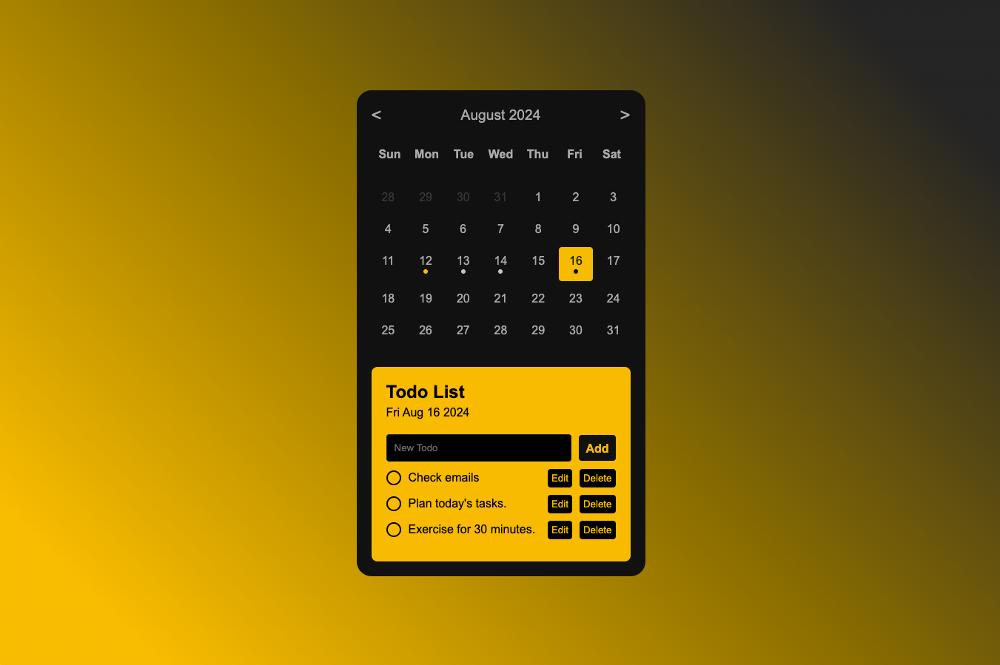

# Todo List Calendar App

一個結合行事曆與待辦事項清單的簡單網頁應用，作為自主練習項目以提升前端開發技能。  
A simple web application that combines a calendar and a to-do list,  
created as a self-practice project to enhance front-end development skills.

## 目錄 / Table of contents

- [Todo List Calendar App](#todo-list-calendar-app)
  - [目錄 / Table of contents](#目錄--table-of-contents)
  - [功能特點 / Features](#功能特點--features)
    - [🔍 概覽 Overview](#-概覽-overview)
    - [🔍 技術概覽 / Technical Overview](#-技術概覽--technical-overview)
    - [📝 待辦事項管理 To-Do Management](#-待辦事項管理-to-do-management)
    - [📁 資料儲存 Data Storage](#-資料儲存-data-storage)

## 功能特點 / Features

### 🔍 概覽 Overview

- 此項目使用 RWD 技術優化，於桌面和手機設備上皆可運行，方便隨時隨地管理代辦事項。  
   This project is optimized with RWD (Responsive Web Design) technology,  
   making it usable on both desktop and mobile devices, allowing task management anytime, anywhere.

---

### 🔍 技術概覽 / Technical Overview

- **JavaScript**
- **HTML5**
- **CSS3**
- **RWD**
- **ES6+（ECMAScript 6+）**
- **Local Storage**
- **DOM**

---

### 📝 待辦事項管理 To-Do Management

- 為選定日期新增、編輯、刪除及標記完成待辦事項。  
   Add, edit, delete, and mark tasks as completed for selected dates.

- 若該日期任務完全完成則顯示為灰色圓點標示，若仍有事項未完成則為黃色標示。  
   If all tasks for a specific date are completed, a gray dot will be displayed;  
   if there are still incomplete tasks, a yellow dot will be shown.

- 為完成的任務添加了動畫效果，讓頁面看起來更動態。  
   Added animation effects for completed tasks to make the page look more dynamic.

---

### 📁 資料儲存 Data Storage

- 使用瀏覽器的 localStorage 來保存待辦事項，確保資料在頁面刷新後不會丟失。  
   Uses browser localStorage to save tasks, ensuring data persists after page refresh.  
